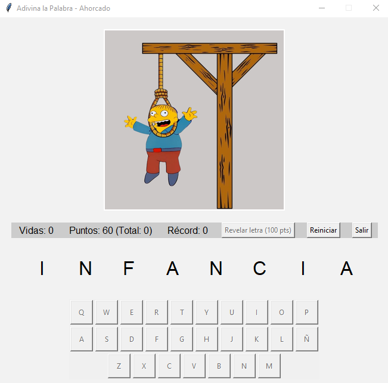

# 🎮 Juego del Ahorcado - Adivina la Palabra



Un clásico juego del ahorcado con interfaz gráfica moderna, sistema de puntuación y múltiples funcionalidades.

## ✨ Características Principales
- **8 vidas** con visualización gráfica progresiva
- **Palabras** organizadas por longitud (5-10 letras)
- Sistema de **puntuación con récord histórico**
- **Teclado virtual integrado** con letras deshabilitadas
- **Revelación de letras** usando puntos acumulados
- **Bonus por vidas restantes** al ganar
- Interfaz intuitiva y responsive
- Reinicio completo con preservación de récords

## 🛠️ Requisitos del Sistema
- Python 3.6 o superior
- Biblioteca Pillow para manejo de imágenes
```bash
  pip install pillow
```
o después de clonar:
```bash
pip install -r requirements.txt
```

## 🚀 Instalación y Ejecución
1 - Clona el repositorio:
```bash
git clone https://github.com/franco-cristian/juego-del-ahorcado-con-python.git
```
2 - Ejecuta el juego (previa instalación de requirements):
```bash
python ahorcado.py
```

## 🎯 Reglas del Juego
Adivina la palabra oculta letra por letra

* Cada error:
  - Reduce una vida (8 vidas iniciales)
  - Avanza la imagen del ahorcado
* Aciertos:
  - +20 puntos por letra correcta
  - Bonus de 40 puntos por vida restante al ganar
* Revelación de letras:
  - Costo inicial: 100 puntos
  - Aumenta 50 puntos por revelación
* Récord:
  - Acumula el máximo histórico de puntos
  - Solo se reinicia manualmente

## 🖼️ Estructura de Archivos
```
/recursos
  ├── /imagenes
  │   ├── ahorcado_0.png    # Estado inicial
  │   ├── ahorcado_1.png
  │   ├── ...
  │   └── ahorcado_8.png    # Estado final
  └── /palabras
      ├── palabras_adivinar_5.txt
      ├── palabras_adivinar_6.txt
      ├── ...
      └── palabras_adivinar_10.txt
ahorcado.py                 # Código principal
README.md                   # Este archivo
```

## 🛠️ Personalización
1. Palabras:
  - Modifica los archivos TXT en /recursos/palabras
  - Formato: una palabra por línea en mayúsculas
2. Dificultad:
```python
# En el método inicializar_juego():
self.vidas = 8  # Cambiar número de vidas
self.puntos_para_revelar = 100  # Costo inicial de revelación
```
3. Imágenes:
  - Reemplaza los archivos en /recursos/imagenes
  - Dimensiones recomendadas: 300x300 px
  - Formato: PNG con fondo transparente

## ⚙️ Lógica del Juego
* Flujo principal:
  1. Selección aleatoria de palabra
  2. Validación de letras ingresadas
  3. Actualización de estado del juego
  4. Cálculo de puntuación en tiempo real
  5. Gestión de revelación de letras

* Sistema de puntos:
```python
Puntos totales = (Letras acertadas × 20) + (Vidas restantes × 50)
```

## 📄 Licencia
Este proyecto está bajo licencia MIT. Consulta el archivo LICENSE para más detalles.